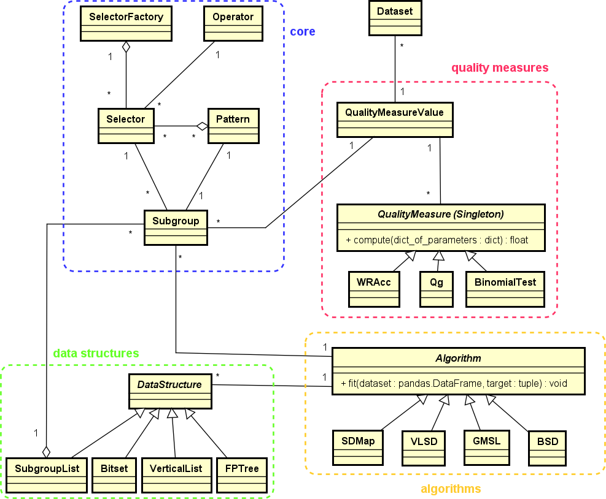

********
Overview
********

``subgroups`` is a public, accessible and open-source python library created to work with the Subgroup Discovery (SD) technique. This library implements the necessary components related to the SD technique and contains a collection of SD algorithms and other data analysis utilities.

============================
Subgroup Discovery technique
============================

Subgroup Discovery (SD) [`1`_, `2`_] is a supervised machine learning (ML) technique that is widely used for descriptive and exploratory data analysis and whose main purpose is to mine a set of relations (denominated as *subgroups*) between attributes from a dataset with respect to a target attribute of interest.

A key aspect of this technique is the assessment of the quality of a subgroup extracted by a SD algorithm. For that, there is a wide variety of metrics (called *quality measures*). A quality measure is, in general, a function that assigns one numeric value to a subgroup according to certain specific properties.

Another essential aspect of this technique is the search strategy used by a SD algorithm. This strategy determines how the search space of the problem is explored and how the subgroups are obtained from it.

==========
Motivation
==========

Despite the utility of the SD technique and the great variety of SD algorithms that appear in literature, few implementations are available for scientists, researchers and developers. Present-day data scientists and ML researchers often depend on highly reliable libraries to test and compare state-of-the-art algorithms such as the classical ML tool Weka, scikit-learn, or Keras or PyTorch in the Deep Learning area. This is not the case in the SD field, in which no community supports the few available libraries. Additionally, it is necessary to use different libraries and tools when working with different SD algorithms since there is no single reference library that implements and brings together a large number of SD algorithms, not even the most popular ones.

The aforementioned disadvantages signify that it is necessary to have a complete library available that implements the most popular algorithms in a faithful form with respect to the original definition without adding modifications, along with a complete documentation of use with different examples. This is precisely the main motivation behind the development of this library.

==========
Objectives
==========

``subgroups`` is intended to provide:

* A complete library that implements the most popular SD algorithms in a faithful form with respect to the original definition without adding modifications.
* A powerful tool with which researchers, scientists, developers and users in general can work with the SD technique.
* An open and collaborative project to which developers can contribute with new functionalities and implementations.  

===============
Potential users
===============

The potential users for ``subgroups`` are scientists, researchers, developers and, in general, all those who wish to work with the SD technique.

==============
General design
==============

The general structure of ``subgroups`` python library is shown as follows:

This library is composed of the following components:

#. core: this contains the basic elements required to work with the SD technique, such as ``Pattern`` or ``Subgroup``.
#. quality_measure: this implements a wide variety of quality measures used by different SD algorithms, such as ``WRAcc`` or ``Binomial Test``, along with some optimistic estimates of these quality measures.
#. data_structures: this includes the data structures used by the SD algorithms implemented, such as ``FPTree`` or ``Vertical list``, among others.
#. algorithms: this implements the SD algorithms, such as ``SDMap`` or ``VLSD``, among others.

``subgroups`` python library also contains many built-in datasets from literature, the corresponding tests for all the functionalities implemented, and a file containing some new software exceptions used by the library.

======================
Implementation details
======================

This library has been implemented in Python 3 using the object-oriented programming paradigm and following the style of ``scikit-learn``, which is a reference in the ML field and is one of the libraries that is best known and most frequently used by the community. Moreover, this library uses different data structures and functionalities provided by ``pandas``, which is also a reference in the ML community.

With respect to the quality measures, the following are currently implemented in the library: Binomial Test, Coverage, Piatetsky Shapiro, Positive Predictive Value (PPV), Negative Predictive Value (NPV), Qg, Sensitivity, Support, Weighted Relative Accuracy (WRAcc), Absolute WRAcc, Specificity, Incremental Response Rate (IRR), F1 Score, and Youden. The library also implements different optimistic estimates for Binominal Test, Piatetsky Shapiro and WRAcc quality measures.

Concerning the algorithms, the following are currently implemented in the library: SDMap, SDMap*, VLSD, BSD, CBSD, CPBSD, QFinder, which generate a subgroup set (i.e. individual subgroups), and GMSL and DSLM, which generate subgroup lists.

This library offers different metrics after executing the algorithms, such as the selected subgroups, the unselected subgroups or the visited nodes, thus allowing users to evaluate the performance of specific executions and to compare different executions with each other.

=============
Free software
=============

``subgroups`` is free software and follows the BSD-3-Clause license. Additional information is available in the `LICENSE`_ file.

.. _`1`: https://doi.org/10.1002/widm.1144
.. _`2`: https://www.mdpi.com/1999-4893/16/6/274
.. _`LICENSE`: https://github.com/antoniolopezmc/subgroups/blob/master/LICENSE
